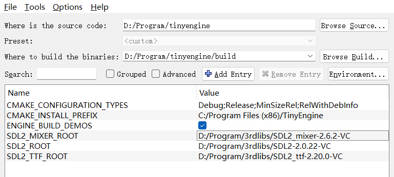
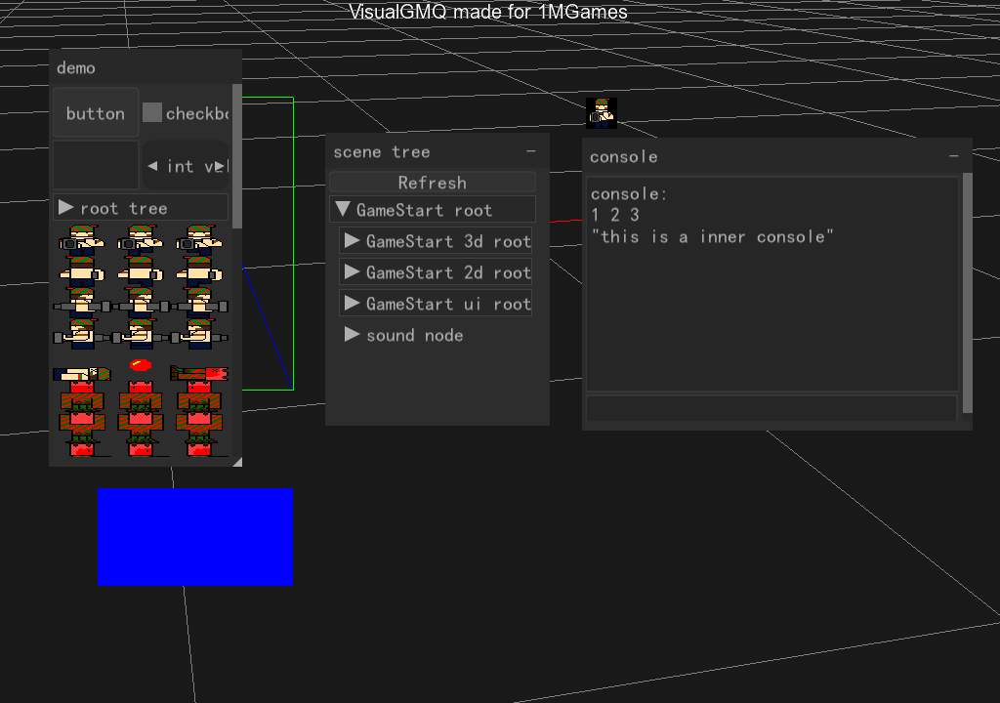

# TinyEngine

## 介绍

TinyEngine是一个为编写1MGames而搭建的底层（我实在是不想每次参赛都写新底层了）。

在Release模式下，helloworld的Demo编译出来有400+KB。但使用UPX压一压能压到100+KB。

## 目录结构

* 3rdlibs：第三方库，主要有
  * SDL：用于搭建窗口
  * SDL_mixer: 用于播放声音
  * SDL_ttf：用于绘制TTF
  * glad：用于导入OpenGL
  * nuklear：用于绘制GUI
  * stb：用于加载图片
* demo：一些Demo，指定`ENGINE_BUILD_DEMOS=ON`可以编译Demo。请在工程跟目录下运行Demo
* engine：底层的头文件
* src：底层的源文件
* shader：底层的着色器
* resources：测试使用的资源
* snapshots：截图

## 编译

```bash
cmake -S . -B build -DSDL2_ROOT=<your sdl2 root dir> -DSDL2_TTF_ROOT=<your sdl2_ttf root dir> -DSDL2_MIXER_ROOT=<your sdl2_mixer root dir>
cmake --build build
```

如果觉得设置路径的命令麻烦，也可以使用cmake-gui:



## 注意事项

本框架目前只支持使用VS编译，因为VS编译出的体积最小，且VS运行库不计入空间。

MinGW由于自己有一套库，发布的时候要带这些库，所以最后结果贼大，不使用。

本工程在VS2022下编译通过。

## 目前的进展

* [x] 基本2D和3D渲染器
* [x] 鼠标键盘输入
* [x] ECS
* [x] 场景
* [x] 2D/3D摄像机
* [x] Configer
* [x] 定时器
* [x] TileSheet
* [x] GUI (使用nuklear)
* [x] 文字绘制
* [x] 音频系统
* [x] 2D Animation

* 便捷调试：
  * [x] 内置场景树查看器
  * [ ] 内置控制台

* 延后：
  * [ ] 使用SIMD加速矩阵计算
  * [ ] 加入json或toml
  * [ ] 2D 物理系统
  * [ ] 加入反射，制作编辑器

## 目前效果


